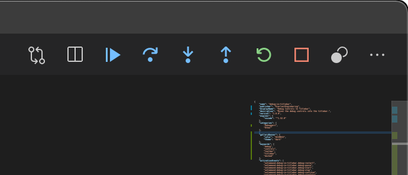

#### [Repository](https://github.com/EverlastEngineering/debugInTitlebar)&nbsp;&nbsp;|&nbsp;&nbsp;[Issues](https://github.com/EverlastEngineering/debugInTitlebar/issues)

*Frustrated by wanting immediate access to the debug controls?* Using the toolbar floating always means _something_ gets hidden by it, so this extension was born while half-paying attention to a Google Meet.

Once installed, go to your Preferences and search for `debug toolbar` and set to docked or hidden to prevent that floating toolbar from wrecking your flow.

This extension reveals the controls here:

There is also an additional control, the Toggle Breakpoints button, which isn't normally visible in the toolbar. This is handy when you are in the midst of a deep dive into code and want to "just run the darn thing" without nuking all your breakpoints. Toggle, play, and toggle back for next time.

# Known Issues

The "Toggle All Breakpoints" button isn't state-aware of the existing breakpoints Enable/Disable button, and currently can't be as VSCode doesn't expose that as a parameter. It just means that the first time you click this extension's Toggle button they might already be disabled. Click it again, and all will work.

Also, no icons show titlebar until a file is open.

## Release Notes
### 1.0.0

Initial release. No plans for additional features at this time. 
